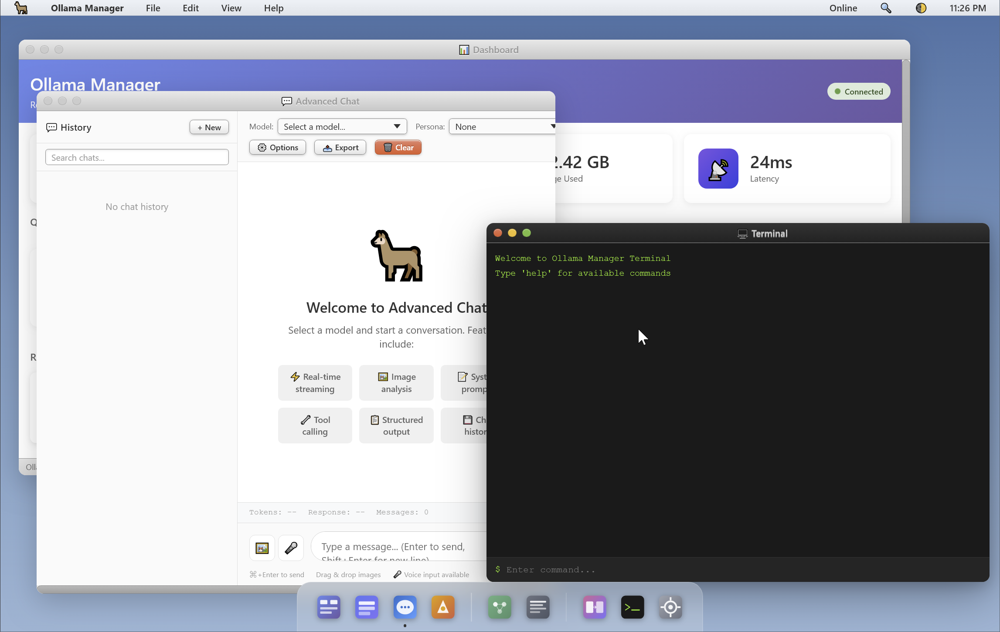

# 🦙 g023's OllamaMan - Ollama Manager

A comprehensive web-based dashboard for managing remote Ollama language model servers. This application provides an intuitive interface for model management, interactive chat, text generation, embeddings visualization, and server monitoring.


## 📋 Overview

Ollama Manager is designed to simplify the management and utilization of Ollama servers running on local networks or remote machines. It offers a unified web interface that eliminates the need for command-line interactions, making AI model deployment and usage accessible to users who prefer graphical interfaces.



### What is Ollama?

Ollama is an open-source platform that enables running large language models locally on your hardware. It supports various model architectures and provides a REST API for programmatic access. Ollama Manager acts as a user-friendly frontend to this API, providing features like:

- **Model Management**: Browse, download, and organize AI models
- **Interactive Chat**: Conversational interface with advanced features
- **Text Generation**: Single-prompt completion tasks
- **Embeddings**: Vector representation generation and visualization
- **Server Monitoring**: Real-time status and performance metrics

## ✨ Key Features

### Core Functionality

#### 📊 Dashboard
- **Server Status Monitoring**: Real-time connection status and latency metrics
- **Model Statistics**: Overview of installed and running models
- **Storage Information**: Disk usage tracking for model storage
- **Quick Actions**: One-click access to common operations

#### 📦 Model Manager
- **Model Library**: Browse available models from Ollama's registry
- **Download Management**: Pull models with progress tracking
- **Model Operations**: Copy, delete, and inspect model details
- **Search and Filter**: Find models by name or capabilities

#### 💬 Advanced Chat Interface
- **Conversational AI**: Full-featured chat with context preservation
- **Streaming Responses**: Real-time text generation for immediate feedback
- **System Prompts**: Customize AI behavior with predefined personas
- **Parameter Tuning**: Adjust temperature, token limits, and sampling settings
- **Chat History**: Persistent conversation storage and retrieval

#### ✨ Text Generation
- **Prompt Engineering**: Single-turn text completion
- **Model Selection**: Choose from available models
- **Parameter Control**: Fine-tune generation settings
- **Output Formatting**: Clean display with syntax highlighting

#### 🎯 Embeddings Playground
- **Vector Generation**: Convert text to numerical representations
- **Visualization**: Interactive charts showing embedding distributions
- **Statistical Analysis**: Mean, min/max values, and dimensionality info
- **Model Compatibility**: Works with embedding-specialized models

#### 📋 API Logs
- **Request Tracking**: Monitor all API interactions
- **Performance Metrics**: Response times and error logging
- **Debugging Tools**: Inspect request/response data
- **Log Management**: Clear and filter log entries

### Advanced Features

#### ⚖️ Model Comparison
- **Side-by-Side Analysis**: Compare outputs from different models
- **Performance Metrics**: Token counts and generation times
- **A/B Testing**: Evaluate model responses for specific tasks

#### 🖥️ Integrated Terminal
- **Command Interface**: Direct access to Ollama CLI commands
- **Output Display**: Formatted terminal output in the web interface
- **Command History**: Recall and reuse previous commands

#### ⚙️ Comprehensive Settings
- **Theme Selection**: Light and dark interface modes
- **Server Configuration**: Dynamic Ollama host and port settings
- **Default Preferences**: Set default models and parameters
- **Auto-Refresh**: Configurable status update intervals
- **Notification Controls**: Manage alert preferences

#### 🔍 Spotlight Search
- **Global Navigation**: Quick access to all features
- **Model Search**: Find models across the registry
- **Command Shortcuts**: Keyboard-driven navigation

#### 🎨 User Interface
- **Window Management**: Draggable, resizable interface windows
- **Notification System**: Toast-style alerts for user feedback
- **Responsive Design**: Adapts to different screen sizes
- **Accessibility**: Keyboard navigation and screen reader support

## 🚀 Installation

### System Requirements

- **Web Server**: Apache, Nginx, or any PHP-compatible server
- **PHP Version**: 7.4 or higher
- **PHP Extensions**: cURL (required for API communication)
- **Ollama Server**: Running instance accessible via HTTP
- **Browser**: Modern web browser with JavaScript enabled

### Quick Setup

1. **Download the Application**
   ```
   # Clone or download to your web server's document root
   # Example paths:
   /var/www/html/ollama-manager/
   # or for local development:
   C:\xampp\htdocs\ollama-manager\
   ```

2. **Configure Server Access**
   
   Edit `api/config.php` to set your Ollama server details:
   ```php
   define('OLLAMA_HOST', '192.168.1.100');  // Your Ollama server IP
   define('OLLAMA_PORT', '11434');         // Default Ollama port
   ```

3. **Server Configuration**
   
   Ensure your Ollama server accepts remote connections:
   ```bash
   # On the Ollama server machine
   OLLAMA_HOST=0.0.0.0 ollama serve
   ```

4. **Access the Interface**
   
   Open your web browser and navigate to:
   ```
   http://localhost/ollama-manager/
   ```

### Directory Permissions

Ensure the web server can write to the `data/` directory for storing settings and logs:
```bash
chmod 755 data/
```

### Database Initialization

The application uses SQLite for data storage. The database is automatically created when first accessed. For manual initialization or migration from older JSON-based storage:

```bash
# Run the database initialization script
php api/init_db.php
```

This will create the database schema and migrate any existing JSON data to SQLite.

## ⚙️ Configuration

### Server Connection

The application connects to Ollama via HTTP API. Key configuration options in `api/config.php`:

- `OLLAMA_HOST`: IP address or hostname of the Ollama server
- `OLLAMA_PORT`: Port number (default: 11434)
- `OLLAMA_TIMEOUT_*`: Various timeout settings for different operations

### Application Settings

Accessible through the Settings window or `api/settings.php`:

- **Server Settings**:
  - **Ollama Host**: IP address or hostname of your Ollama server
  - **Ollama Port**: Port number (default: 11434)
- **Theme**: Interface appearance (light/dark)
- **Default Model**: Pre-selected model for chat and generation
- **Auto-refresh Interval**: Status update frequency
- **Notification Preferences**: Alert display settings

## 📖 Usage Guide

### Getting Started

1. **Verify Connection**: Check the server status indicator in the top menu bar
2. **Load Models**: Use the Model Manager to browse and download models
3. **Start Chatting**: Open the Chat window and select a model
4. **Explore Features**: Try text generation and embeddings playground

### Model Management

#### Downloading Models
- Navigate to Model Manager window
- Browse or search for models
- Click "Pull Model" to download
- Monitor progress in the interface

#### Model Information
- Select a model to view details
- See size, modification date, and capabilities
- Copy or delete models as needed

### Chat Interface

#### Basic Conversation
- Select a model from the dropdown
- Type messages in the input field
- Press Enter or click send button
- Responses appear in real-time with streaming

#### Advanced Features
- **System Prompts**: Set AI behavior with custom instructions
- **Parameters**: Adjust creativity and response length
- **Image Input**: Upload images for vision-capable models
- **Tool Calling**: Enable function calling for enhanced capabilities
- **Structured Output**: Generate JSON responses with schemas

#### Chat History
- Conversations are automatically saved
- Access previous chats from the sidebar
- Search through chat history
- Export conversations for external use

### Text Generation

#### Single Prompts
- Choose a model and enter a prompt
- Adjust generation parameters
- Generate and view formatted output
- Useful for creative writing, code generation, etc.

### Embeddings Visualization

#### Vector Analysis
- Select an embedding model
- Input text for vector conversion
- View statistical properties
- Visualize embedding distributions

### Monitoring and Logs

#### Server Status
- Real-time connection monitoring
- Performance metrics display
- Running model tracking

#### API Logs
- View all API requests and responses
- Debug failed operations
- Monitor usage patterns

## 🔧 API Reference

The application provides a REST API for programmatic access. All endpoints return JSON responses.

### Response Format
```json
{
  "success": true|false,
  "data": { ... } | null,
  "error": "message" | null
}
```

### Available Endpoints

| Endpoint | Method | Description |
|----------|--------|-------------|
| `/api/status.php` | GET | Server status and statistics |
| `/api/models.php?action=list` | GET | List available models |
| `/api/models.php?action=show&model=name` | GET | Get model details |
| `/api/models.php?action=pull` | POST | Download a model |
| `/api/models.php?action=delete` | POST | Remove a model |
| `/api/models.php?action=copy` | POST | Duplicate a model |
| `/api/chat.php` | POST | Send chat message |
| `/api/generate.php` | POST | Generate text completion |
| `/api/embed.php` | POST | Create embeddings |
| `/api/settings.php?action=get` | GET | Retrieve settings |
| `/api/settings.php?action=save` | POST | Update settings |
| `/api/history.php?action=list` | GET | Get chat history |
| `/api/logs.php?action=list` | GET | View API logs |

### Example API Usage

#### Chat Request
```javascript
fetch('api/chat.php', {
  method: 'POST',
  headers: { 'Content-Type': 'application/json' },
  body: JSON.stringify({
    model: 'llama2',
    messages: [{ role: 'user', content: 'Hello!' }]
  })
})
.then(response => response.json())
.then(data => console.log(data));
```

## 🛠️ Development

### Architecture

The application follows a client-server architecture:

- **Frontend**: HTML, CSS, JavaScript (jQuery)
- **Backend**: PHP API layer
- **Database**: SQLite for data persistence
- **Styling**: Custom CSS with theme support

### Project Structure
```
ollama-manager/
├── index.php              # Main application interface
├── api/                   # Backend API endpoints
│   ├── config.php         # Configuration constants
│   ├── ollama.php         # Ollama API wrapper
│   ├── database.php       # Data persistence layer
│   └── *.php              # Individual API handlers
├── assets/                # Static resources
│   ├── css/               # Stylesheets
│   ├── js/                # JavaScript logic
│   └── images/            # Interface graphics
├── data/                  # Application data storage
└── KNOWLEDGE_BASE/        # Development documentation
```

### Key Technologies

- **PHP**: Server-side logic and API implementation
- **SQLite**: Lightweight database for settings and history
- **jQuery**: DOM manipulation and AJAX communication
- **Chart.js**: Data visualization (embeddings)
- **Highlight.js**: Syntax highlighting for code
- **Marked.js**: Markdown rendering

### Extending the Application

#### Adding New Features
1. Create API endpoint in `api/` directory
2. Add frontend JavaScript in `assets/js/app.js`
3. Update HTML interface in `index.php`
4. Add database schema changes if needed

#### Custom Themes
- Modify CSS variables in `assets/css/`
- Create new theme files following existing patterns
- Update theme selection in settings

## 📄 License

This project is licensed under the BSD 3-Clause License - see the [LICENSE](LICENSE) file for details.

Copyright (c) 2024, g023

## 👤 Author

**g023**  
- GitHub: [g023](https://github.com/g023)  
- X (Twitter): [@g023dev](https://x.com/g023dev)

## 🙏 Acknowledgments

- Built for the Ollama community
- Inspired by the need for accessible AI model management

---

**Enjoy managing your AI models with Ollama Manager! 🦙✨**